# Alur Fitur Aplikasi IKA SMANSARA

Dokumen ini menjelaskan alur (flow) untuk setiap fitur dalam aplikasi berdasarkan skema database.

---

## Daftar Isi

1. [Autentikasi & Registrasi](#1-autentikasi--registrasi)
2. [Event & Tiket](#2-event--tiket)
3. [Donasi](#3-donasi)
4. [Forum](#4-forum)
5. [Lowongan Kerja (Loker)](#5-lowongan-kerja-loker)
6. [Market (Jual-Beli)](#6-market-jual-beli)
7. [Galeri Kenangan](#7-galeri-kenangan)
8. [Direktori Alumni](#8-direktori-alumni)
9. [Berita](#9-berita)

---

## 1. Autentikasi & Registrasi

### 1.1 Registrasi Alumni

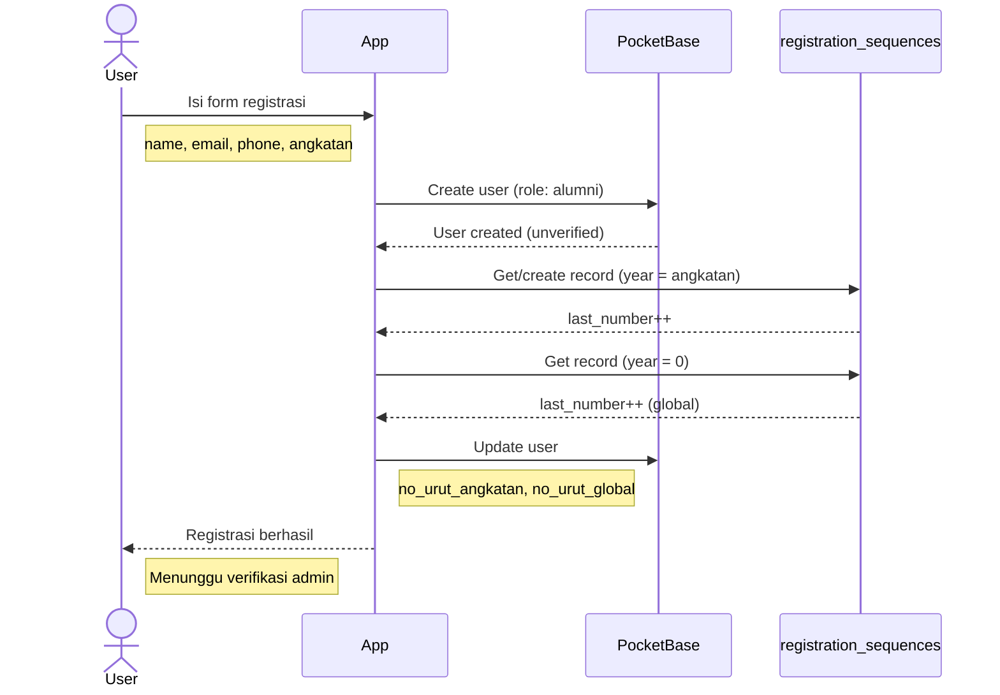

**Flow:**
1. User mengisi form dengan data lengkap
2. Sistem membuat akun dengan `role = alumni`, `is_verified = false`
3. Sistem generate nomor EKTA:
   - Ambil/buat `registration_sequences` dengan `year = angkatan`
   - Increment `last_number` → dapat `no_urut_angkatan`
   - Increment record `year = 0` → dapat `no_urut_global`
4. Format EKTA: `{angkatan}.{no_urut_angkatan:04d}.{no_urut_global}`
5. Admin memverifikasi akun

### 1.2 Login

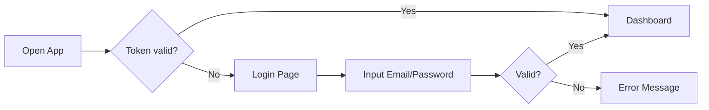

---

## 2. Event & Tiket

### 2.1 Melihat Event

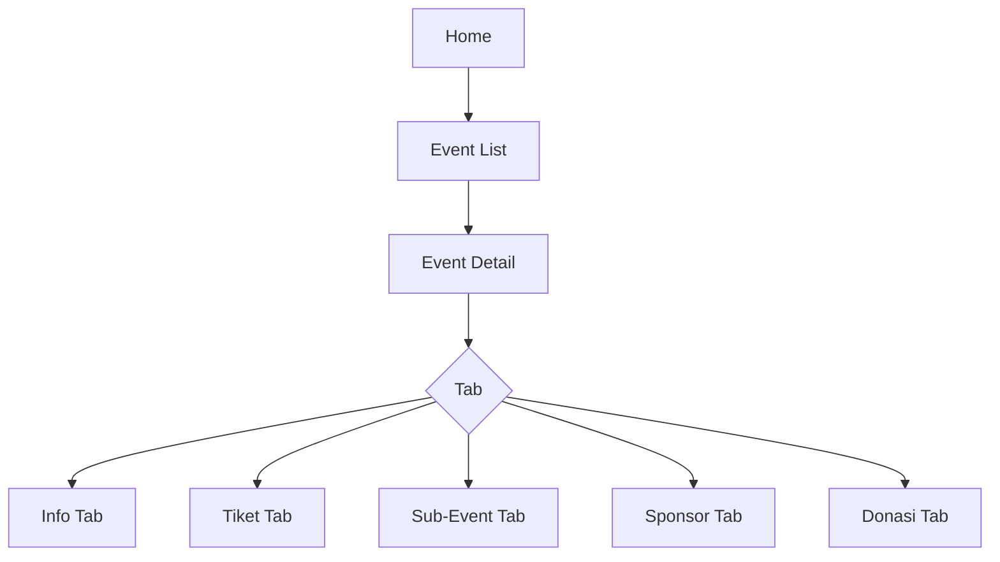

### 2.2 Pembelian Tiket

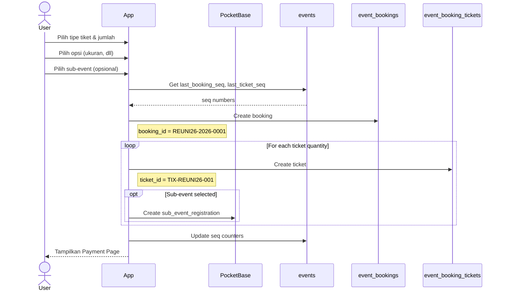

**Collections Terkait:**
- `events` → informasi event + counter
- `event_tickets` → tipe tiket (VIP, Regular)
- `event_ticket_options` → opsi tambahan (ukuran kaos)
- `event_bookings` → order/invoice
- `event_booking_tickets` → tiket individual
- `event_sub_events` → sub-event (cek kesehatan, dll)
- `event_sub_event_registrations` → pendaftaran sub-event

### 2.3 Check-in Event

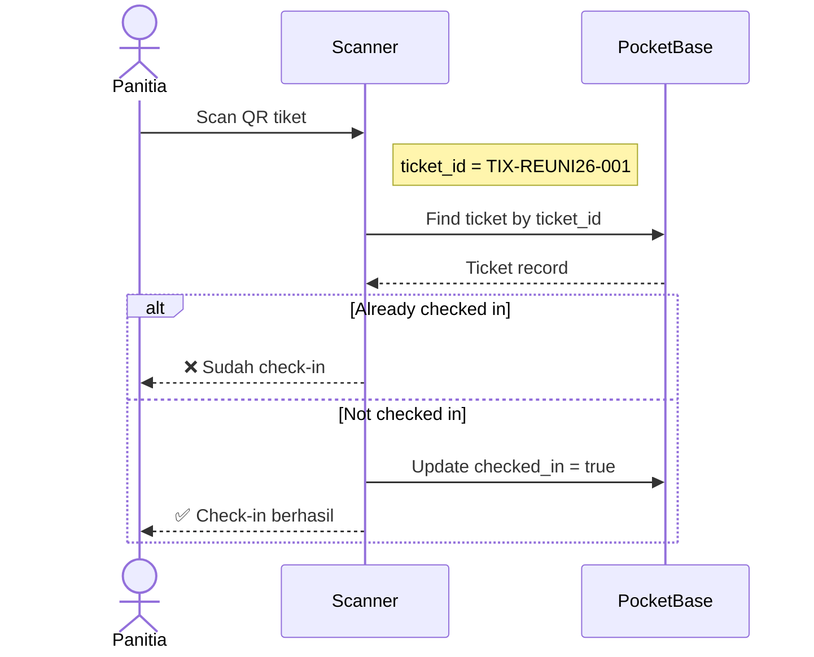

### 2.4 Pengambilan Kaos

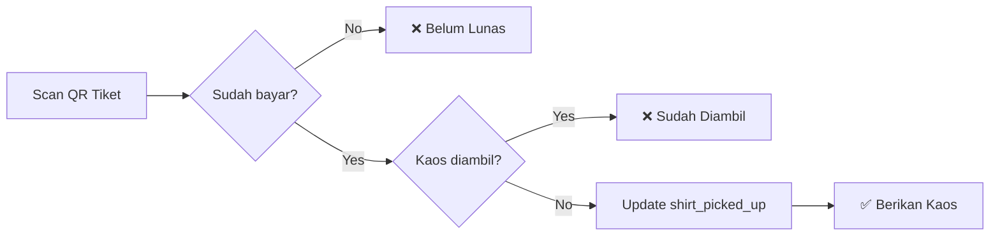

---

## 3. Donasi

### 3.1 Donasi Campaign

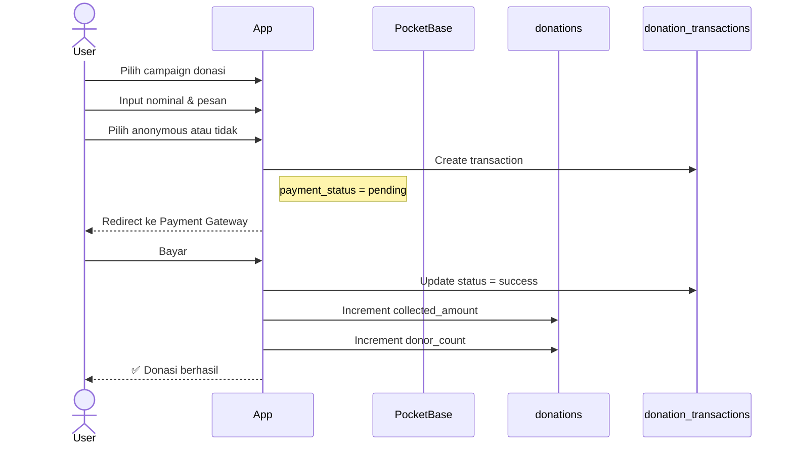

### 3.2 Donasi Event

```mermaid
flowchart TD
    A[Event Detail] --> B[Tab Donasi]
    B --> C[Input Nominal]
    C --> D[Bayar]
    D --> E[donation_transactions]
    Note right of E: event = event_id<br/>donation = null
```

**Perbedaan:**
- **Campaign Donasi**: `donation = donation_id`, `event = null`
- **Donasi Event**: `donation = null`, `event = event_id`

---

## 4. Forum

### 4.1 Membuat Post

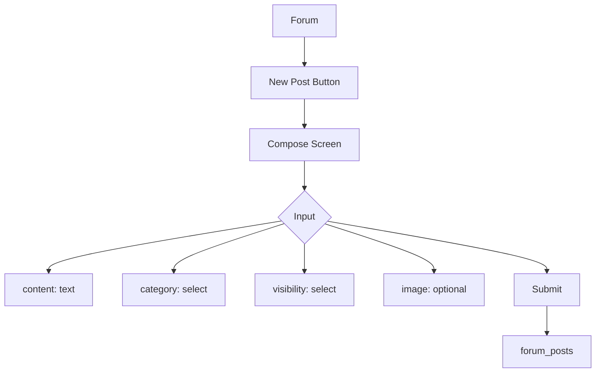

### 4.2 Interaksi Post

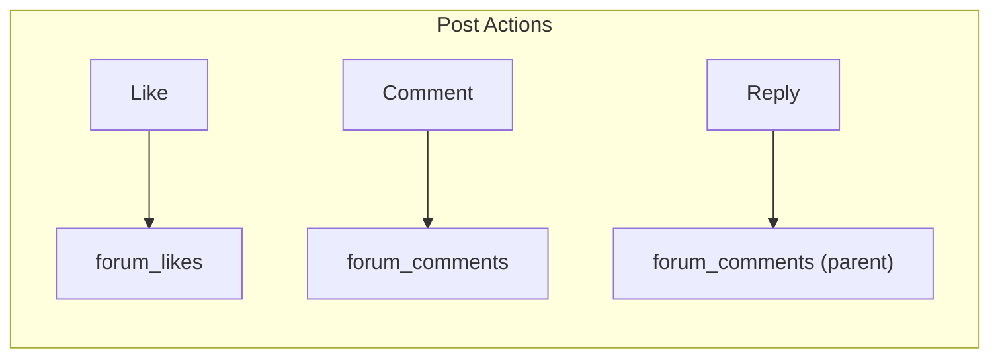

**Visibility Rules:**
- `public`: Semua user bisa lihat
- `alumni_only`: Hanya alumni terverifikasi

---

## 5. Lowongan Kerja (Loker)

### 5.1 Posting Loker

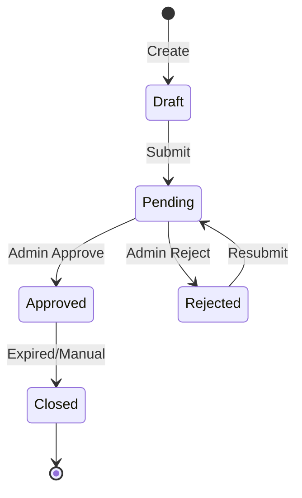

### 5.2 Melamar Lowongan

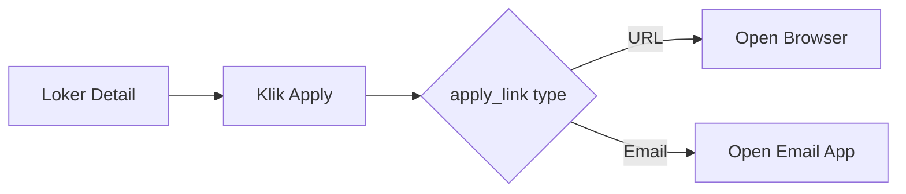

---

## 6. Market (Jual-Beli)

### 6.1 Posting Produk

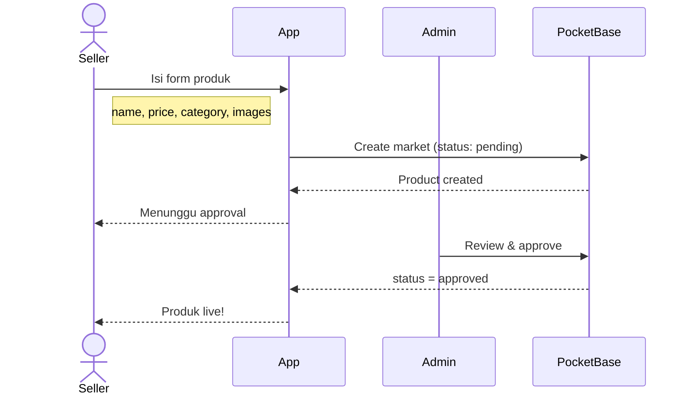

### 6.2 Kategori Produk

| Kategori | Contoh |
|----------|--------|
| `kuliner` | Katering, kue, makanan |
| `fashion` | Batik, tas, sepatu |
| `jasa_professional` | Konsultan, arsitek |
| `properti` | Rumah, tanah, kost |
| `lainnya` | Lain-lain |

---

## 7. Galeri Kenangan

### 7.1 Upload Foto

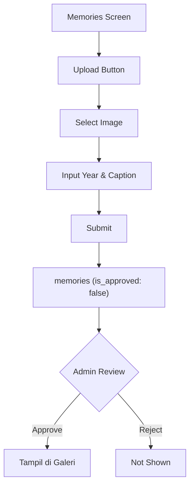

### 7.2 Browsing Galeri

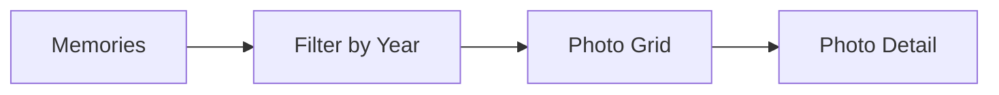

---

## 8. Direktori Alumni

### 8.1 Pencarian Alumni

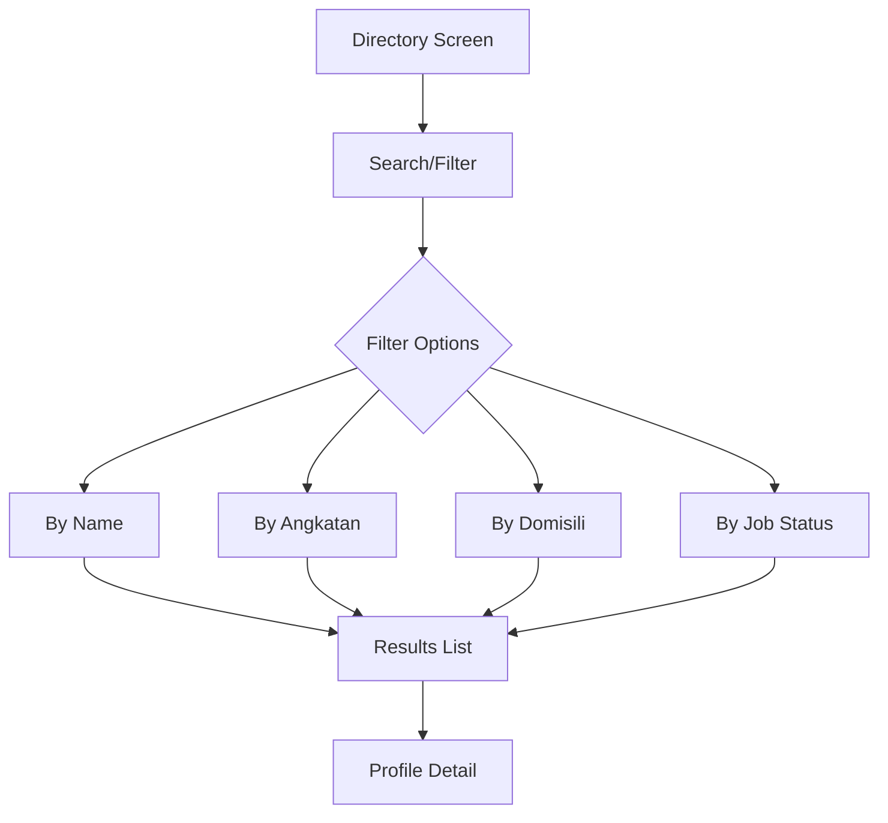

**Access Rules:**
- Hanya menampilkan user dengan `is_verified = true`
- List/View: Admin only (API level)
- Client harus memiliki token admin atau custom rule

### 8.2 Profile View

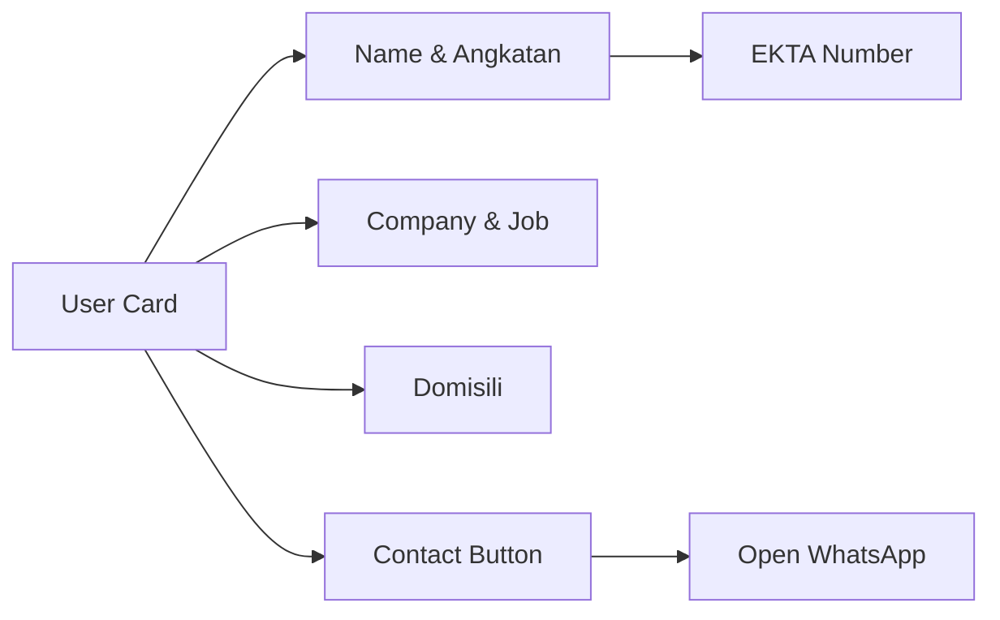

---

## 9. Berita

### 9.1 News Flow

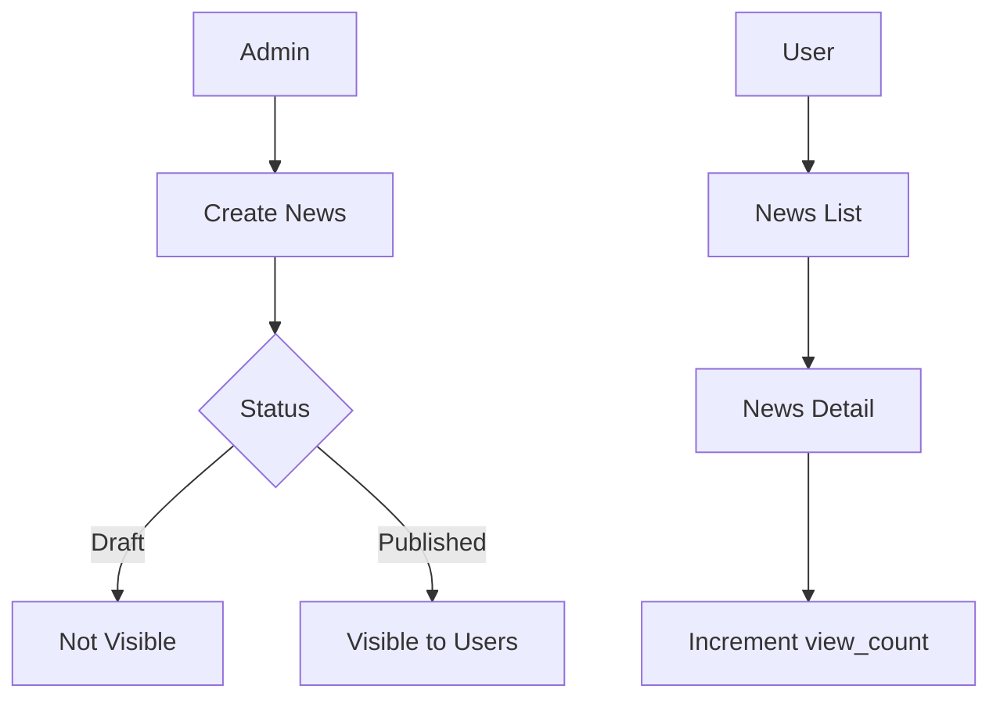

### 9.2 Kategori Berita

- `prestasi` - Prestasi siswa/alumni
- `kegiatan` - Kegiatan sekolah/alumni
- `pengumuman` - Pengumuman resmi
- `alumni_sukses` - Profil alumni sukses
- `lainnya` - Berita lainnya

---

## QR Code Strategy

> **QR codes tidak disimpan di database.** Generate client-side dari ID unik.

| QR Type | Source Field | Example |
|---------|--------------|---------|
| Booking | `booking_id` | `REUNI26-2026-0001` |
| Ticket | `ticket_id` | `TIX-REUNI26-001` |
| Sub-Event | `sub_event_ticket_id` | `REUNI26-CEK-001` |

```javascript
// Client-side generation
import QRCode from 'qrcode';

const ticketId = 'TIX-REUNI26-001';
QRCode.toDataURL(ticketId, (err, url) => {
  // Display as image
});
```

---

## Database Hooks (Auto-Update)

| Trigger | Action |
|---------|--------|
| Donation transaction `success` | Update `donations.collected_amount` & `donor_count` |
| Booking `paid` | Update `event_tickets.sold` |
| Sub-event registration created | Update `event_sub_events.registered` |
