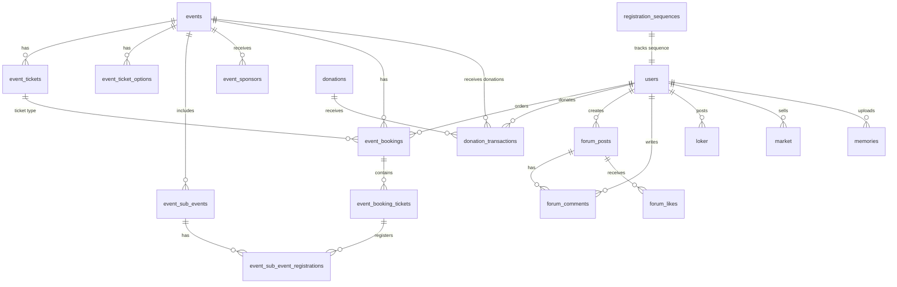

# Database Schema - IKA SMANSARA (PocketBase)

Skema database untuk aplikasi IKA SMANSARA menggunakan PocketBase.

---

## Collections Overview



---

## 1. Users (Extends PocketBase Auth)

Koleksi bawaan PocketBase `users` dengan field tambahan.

| Field | Type | Required | Notes |
|-------|------|----------|-------|
| `name` | text | ✅ | Nama lengkap |
| `email` | email | ✅ | (PocketBase default) |
| `phone` | text | ✅ | No. WhatsApp |
| `avatar` | file | ❌ | Foto profil |
| `angkatan` | number | ❌ | Tahun lulus (null = Public) |
| `no_urut_angkatan` | number | ❌ | No urut per angkatan (4 digit) |
| `no_urut_global` | number | ❌ | No urut global pendaftaran |
| `role` | select | ✅ | `alumni`, `public`, `admin` |
| `job_status` | select | ❌ | `swasta`, `pns_bumn`, `wirausaha`, `mahasiswa`, `lainnya` |
| `company` | text | ❌ | Nama perusahaan/instansi |
| `domisili` | text | ❌ | Kota domisili |
| `is_verified` | bool | ✅ | Default: false |
| `verified_at` | date | ❌ | Tanggal verifikasi |

**API Rules:**
- Create: Anyone (register)
- List/View: Admin only (untuk directory, filter by verified)
- Update: Owner or Admin
- Delete: Admin only

**Nomor EKTA Format:** `{angkatan}.{no_urut_angkatan:4d}.{no_urut_global}`
- Contoh: `2010.0010.121` = Angkatan 2010, urut ke-10 di angkatan, urut ke-121 global

---

## 2. Registration Sequences (Helper)

Collection pembantu untuk menyimpan counter sequence nomor EKTA per angkatan.

| Field | Type | Required | Notes |
|-------|------|----------|-------|
| `year` | number | ✅ | Tahun angkatan (unique) |
| `last_number` | number | ✅ | Counter terakhir untuk angkatan ini (default: 0) |

**Special Record:** Satu record dengan `year = 0` untuk menyimpan `last_number` sebagai counter global.

**API Rules:**
- Create: Admin only
- List/View: Admin only
- Update: Admin only (increment saat user register)
- Delete: Admin only

**Usage Flow:**
1. User register dengan `angkatan = 2010`
2. System cari/buat record `registration_sequences` dengan `year = 2010`
3. Increment `last_number` untuk angkatan tersebut → dapat `no_urut_angkatan`
4. Increment record `year = 0` → dapat `no_urut_global`
5. Format EKTA: `2010.{no_urut_angkatan:04d}.{no_urut_global}`

---

## 3. Events

| Field | Type | Required | Notes |
|-------|------|----------|-------|
| `title` | text | ✅ | Judul event |
| `code` | text | ✅ | Kode prefix event (uppercase, e.g., `REUNI26`) |
| `date` | date | ✅ | Tanggal event |
| `time` | text | ✅ | Format: HH:mm |
| `location` | text | ✅ | Lokasi event |
| `description` | editor | ❌ | Deskripsi lengkap |
| `banner` | file | ❌ | Gambar banner |
| `status` | select | ✅ | `draft`, `active`, `completed` |
| `enable_sponsorship` | bool | ✅ | Default: false |
| `enable_donation` | bool | ✅ | Default: false |
| `donation_target` | number | ❌ | Target donasi (opsional) |
| `donation_description` | text | ❌ | Deskripsi donasi |
| `booking_id_format` | text | ✅ | Default: `{CODE}-{YEAR}-{SEQ}` |
| `ticket_id_format` | text | ✅ | Default: `TIX-{CODE}-{SEQ}` |
| `last_booking_seq` | number | ✅ | Counter untuk SEQ (default: 0) |
| `last_ticket_seq` | number | ✅ | Counter untuk ticket SEQ (default: 0) |
| `created_by` | relation | ✅ | → users |

---

## 4. Event Tickets (Tipe Tiket)

Jenis/paket tiket yang tersedia untuk event.

| Field | Type | Required | Notes |
|-------|------|----------|-------|
| `event` | relation | ✅ | → events |
| `name` | text | ✅ | Nama paket tiket |
| `price` | number | ✅ | Harga tiket (Rp) |
| `quota` | number | ✅ | Kuota peserta |
| `sold` | number | ✅ | Terjual (default: 0) |
| `includes` | json | ❌ | Array of string (contoh: `["Kaos", "Snack"]`) |
| `image` | file | ❌ | Preview kaos/tiket |

---

## 5. Event Ticket Options

Opsi tambahan tiket (misal: ukuran kaos).

| Field | Type | Required | Notes |
|-------|------|----------|-------|
| `ticket` | relation | ✅ | → event_tickets |
| `name` | text | ✅ | Nama opsi (contoh: "Ukuran Kaos") |
| `choices` | json | ✅ | Array of `{label, extra_price}` |

---

## 6. Event Sub-Events

Kegiatan pendukung (cek kesehatan, donor darah, dll).

| Field | Type | Required | Notes |
|-------|------|----------|-------|
| `event` | relation | ✅ | → events |
| `name` | text | ✅ | Nama kegiatan |
| `description` | text | ❌ | Deskripsi singkat |
| `quota` | number | ❌ | Kuota (null = unlimited) |
| `registered` | number | ✅ | Terdaftar (default: 0) |
| `location` | text | ❌ | Lokasi stand |

---

## 7. Event Sponsors

Paket sponsorship untuk event.

| Field | Type | Required | Notes |
|-------|------|----------|-------|
| `event` | relation | ✅ | → events |
| `tier_name` | text | ✅ | Nama tier (Platinum, Gold, dll) |
| `price` | number | ✅ | Harga paket (Rp) |
| `benefits` | json | ✅ | Array of string |
| `logo` | file | ❌ | Logo sponsor (jika sudah ada) |
| `company_name` | text | ❌ | Nama perusahaan sponsor |
| `is_filled` | bool | ✅ | Default: false |

---

## 8. Event Bookings (Order/Invoice)

Satu record = satu pesanan (bisa berisi banyak tiket).

| Field | Type | Required | Notes |
|-------|------|----------|-------|
| `booking_id` | text | ✅ | ID unik, e.g., `REUNI26-2026-0001` |
| `event` | relation | ✅ | → events |
| `user` | relation | ✅ | → users |
| `metadata` | json | ✅ | Snapshot item tiket (array of `{ticket_id, quantity, options}`) |
| `total_price` | number | ✅ | Total harga (tiket + opsi) |
| `payment_status` | select | ✅ | `pending`, `paid`, `expired`, `refunded` |
| `payment_method` | text | ❌ | Metode pembayaran |
| `payment_date` | date | ❌ | Tanggal bayar |
| `snap_token` | text | ❌ | Midtrans Snap Token |
| `snap_redirect_url` | text | ❌ | Midtrans Snap Redirect URL |
| `is_deleted` | number | ❌ | Soft delete status (0=active, 1=deleted) |
| `coordinator_name` | text | ❌ | Nama koordinator (untuk manual booking) |
| `coordinator_phone` | text | ❌ | No. HP koordinator |
| `coordinator_angkatan` | number | ❌ | Angkatan Koordinator (misal 2010) |
| `registration_channel` | select | ❌ | `app`, `manual_cash`, `manual_transfer` |
| `manual_ticket_count` | number | ❌ | Jumlah tiket manual (jika ada) |
| `manual_ticket_type` | relation | ❌ | → event_tickets (untuk manual booking) |
| `payment_proof` | file | ❌ | Bukti transfer (untuk manual booking) |
| `notes` | text | ❌ | Catatan admin |

> **QR Booking ID**: Generate dari field `booking_id`. Tidak perlu disimpan.

---

## 9. Event Booking Tickets (Tiket Individual)

Satu record = satu tiket fisik. Child dari `event_bookings`.

| Field | Type | Required | Notes |
|-------|------|----------|-------|
| `ticket_id` | text | ✅ | ID unik, e.g., `TIX-REUNI26-001` |
| `booking` | relation | ✅ | → event_bookings |
| `ticket_type` | relation | ✅ | → event_tickets |
| `selected_options` | json | ❌ | Opsi untuk tiket ini (e.g., `{size: "XL"}`) |
| `shirt_picked_up` | bool | ✅ | Default: false |
| `shirt_pickup_time` | date | ❌ | Waktu ambil kaos |
| `checked_in` | bool | ✅ | Default: false |
| `checkin_time` | date | ❌ | Waktu check-in event utama |

> **QR Ticket ID**: Generate dari field `ticket_id`. Tidak perlu disimpan.

---

## 10. Event Sub-Event Registrations

Satu record = satu tiket mendaftar satu sub-event.

| Field | Type | Required | Notes |
|-------|------|----------|-------|
| `sub_event_ticket_id` | text | ✅ | ID unik, e.g., `REUNI26-CEK-001` |
| `booking_ticket` | relation | ✅ | → event_booking_tickets |
| `sub_event` | relation | ✅ | → event_sub_events |
| `checked_in` | bool | ✅ | Default: false |
| `checkin_time` | date | ❌ | Waktu check-in sub-event |

> **Constraint**: Total pendaftaran sub-event per booking ≤ jumlah tiket di booking.

> **QR Sub-Event Ticket ID**: Generate dari field `sub_event_ticket_id`. Tidak perlu disimpan.

---

## 11. Donations (Campaigns)

| Field | Type | Required | Notes |
|-------|------|----------|-------|
| `title` | text | ✅ | Judul campaign |
| `description` | editor | ✅ | Deskripsi lengkap |
| `target_amount` | number | ✅ | Target donasi (Rp) |
| `collected_amount` | number | ✅ | Terkumpul (default: 0) |
| `deadline` | date | ✅ | Batas waktu |
| `banner` | file | ❌ | Gambar banner |
| `organizer` | text | ✅ | Nama penyelenggara |
| `category` | select | ✅ | `infrastruktur`, `pendidikan`, `sosial`, `kesehatan`, `lainnya` |
| `priority` | select | ✅ | `normal`, `urgent` |
| `status` | select | ✅ | `draft`, `active`, `completed`, `closed` |
| `donor_count` | number | ✅ | Jumlah donatur (default: 0) |
| `created_by` | relation | ✅ | → users |

---

## 12. Donation Transactions

| Field | Type | Required | Notes |
|-------|------|----------|-------|
| `donation` | relation | ❌ | → donations (null jika donasi event) |
| `event` | relation | ❌ | → events (null jika donasi campaign) |
| `user` | relation | ❌ | → users (null = anonim) |
| `donor_name` | text | ✅ | Nama donatur (bisa "Hamba Allah") |
| `amount` | number | ✅ | Jumlah donasi (Rp) |
| `message` | text | ❌ | Pesan/doa |
| `is_anonymous` | bool | ✅ | Default: false |
| `payment_status` | select | ✅ | `pending`, `success`, `failed` |
| `payment_method` | text | ❌ | Metode pembayaran |
| `transaction_id` | text | ✅ | ID transaksi unik |
| `snap_token` | text | ❌ | Midtrans Snap Token |
| `snap_redirect_url` | text | ❌ | Midtrans Snap Redirect URL |

> **Note:** Transaksi harus memiliki salah satu dari `donation` ATAU `event`, tidak boleh keduanya kosong.

---

## 13. News

| Field | Type | Required | Notes |
|-------|------|----------|-------|
| `title` | text | ✅ | Judul berita |
| `slug` | text | ✅ | URL-friendly ID |
| `category` | select | ✅ | `prestasi`, `kegiatan`, `pengumuman`, `alumni_sukses`, `lainnya` |
| `thumbnail` | file | ❌ | Gambar thumbnail |
| `summary` | text | ✅ | Ringkasan (preview) |
| `content` | editor | ✅ | Konten lengkap |
| `author` | relation | ✅ | → users |
| `publish_date` | date | ✅ | Tanggal publish |
| `status` | select | ✅ | `draft`, `published` |
| `view_count` | number | ✅ | Default: 0 |

---

## 14. Forum Posts

| Field | Type | Required | Notes |
|-------|------|----------|-------|
| `user` | relation | ✅ | → users |
| `content` | text | ✅ | Isi postingan |
| `image` | file | ❌ | Gambar lampiran |
| `category` | select | ✅ | `karir_loker`, `nostalgia`, `bisnis`, `umum` |
| `visibility` | select | ✅ | `public`, `alumni_only` |
| `like_count` | number | ✅ | Default: 0 |
| `comment_count` | number | ✅ | Default: 0 |
| `is_pinned` | bool | ✅ | Default: false |
| `status` | select | ✅ | `active`, `hidden`, `deleted` |

---

## 15. Forum Comments

| Field | Type | Required | Notes |
|-------|------|----------|-------|
| `post` | relation | ✅ | → forum_posts |
| `user` | relation | ✅ | → users |
| `content` | text | ✅ | Isi komentar |
| `parent` | relation | ❌ | → forum_comments (untuk reply) |

---

## 16. Forum Likes

| Field | Type | Required | Notes |
|-------|------|----------|-------|
| `post` | relation | ✅ | → forum_posts |
| `user` | relation | ✅ | → users |

**Unique Index:** `post` + `user`

---

## 17. Loker (Lowongan Kerja)

| Field | Type | Required | Notes |
|-------|------|----------|-------|
| `user` | relation | ✅ | → users (poster) |
| `position` | text | ✅ | Posisi/jabatan |
| `company` | text | ✅ | Nama perusahaan |
| `job_type` | select | ✅ | `fulltime`, `parttime`, `internship`, `freelance`, `remote` |
| `location` | text | ✅ | Lokasi kerja |
| `salary_range` | text | ❌ | Kisaran gaji |
| `description` | editor | ✅ | Deskripsi & syarat |
| `apply_link` | text | ✅ | Link/email lamaran |
| `status` | select | ✅ | `pending`, `approved`, `rejected`, `closed` |
| `expires_at` | date | ❌ | Tanggal kadaluarsa |

---

## 18. Market (Iklan Jual-Beli)

| Field | Type | Required | Notes |
|-------|------|----------|-------|
| `user` | relation | ✅ | → users (penjual) |
| `name` | text | ✅ | Nama produk |
| `category` | select | ✅ | `kuliner`, `fashion`, `jasa_professional`, `properti`, `lainnya` |
| `price` | number | ✅ | Harga (Rp) |
| `description` | editor | ❌ | Deskripsi produk |
| `images` | file[] | ❌ | Foto produk (multiple) |
| `location` | text | ✅ | Lokasi |
| `contact` | text | ❌ | Kontak (default: user.phone) |
| `status` | select | ✅ | `pending`, `approved`, `rejected`, `sold` |

---

## 19. Memories (Galeri Kenangan)

| Field | Type | Required | Notes |
|-------|------|----------|-------|
| `user` | relation | ✅ | → users (uploader) |
| `image` | file | ✅ | Foto kenangan |
| `year` | number | ✅ | Tahun foto |
| `description` | text | ❌ | Deskripsi/caption |
| `is_approved` | bool | ✅ | Default: false |
| `approved_by` | relation | ❌ | → users (admin) |

---

## Indexes & Performance

```sql
-- Event Bookings
CREATE INDEX idx_booking_user ON event_bookings(user);
CREATE INDEX idx_booking_event ON event_bookings(event);
CREATE INDEX idx_booking_status ON event_bookings(payment_status);
CREATE UNIQUE INDEX idx_booking_id ON event_bookings(booking_id);

-- Event Booking Tickets
CREATE INDEX idx_ticket_booking ON event_booking_tickets(booking);
CREATE UNIQUE INDEX idx_ticket_id ON event_booking_tickets(ticket_id);

-- Event Sub-Event Registrations
CREATE INDEX idx_subevent_reg_ticket ON event_sub_event_registrations(booking_ticket);
CREATE INDEX idx_subevent_reg_subevent ON event_sub_event_registrations(sub_event);
CREATE UNIQUE INDEX idx_subevent_ticket_id ON event_sub_event_registrations(sub_event_ticket_id);

-- Donation Transactions
CREATE INDEX idx_donation_trx ON donation_transactions(donation);
CREATE INDEX idx_donation_status ON donation_transactions(payment_status);

-- Forum
CREATE INDEX idx_forum_category ON forum_posts(category);
CREATE INDEX idx_forum_user ON forum_posts(user);

-- Loker & Market (untuk moderation)
CREATE INDEX idx_loker_status ON loker(status);
CREATE INDEX idx_market_status ON market(status);
```

---

## PocketBase Hooks

```javascript
// Auto-update donation collected_amount after successful transaction
onRecordAfterCreateRequest((e) => {
    const record = e.record;
    if (record.collection() === 'donation_transactions' && record.getString('payment_status') === 'success') {
        const donationId = record.getString('donation');
        if (donationId) {
            const donation = $app.dao().findRecordById('donations', donationId);
            donation.set('collected_amount', donation.getInt('collected_amount') + record.getInt('amount'));
            donation.set('donor_count', donation.getInt('donor_count') + 1);
            $app.dao().saveRecord(donation);
        }
    }
});

// Auto-update event ticket sold count when booking is paid
onRecordAfterUpdateRequest((e) => {
    const record = e.record;
    if (record.collection() === 'event_bookings' && record.getString('payment_status') === 'paid') {
        const ticketId = record.getString('ticket_type');
        const quantity = record.getInt('quantity');
        
        const ticket = $app.dao().findRecordById('event_tickets', ticketId);
        ticket.set('sold', ticket.getInt('sold') + quantity);
        $app.dao().saveRecord(ticket);
    }
});

// Auto-update sub-event registered count
onRecordAfterCreateRequest((e) => {
    const record = e.record;
    if (record.collection() === 'event_sub_event_registrations') {
        const subEventId = record.getString('sub_event');
        
        const subEvent = $app.dao().findRecordById('event_sub_events', subEventId);
        subEvent.set('registered', subEvent.getInt('registered') + 1);
        $app.dao().saveRecord(subEvent);
    }
});
```

---

## QR Code Generation Strategy

> **QR codes are NOT stored in the database.** They are generated client-side from the unique ID fields.

| QR Type | Source Field | Example Value |
|---------|--------------|---------------|
| Booking QR | `event_bookings.booking_id` | `REUNI26-2026-0001` |
| Ticket QR | `event_booking_tickets.ticket_id` | `TIX-REUNI26-001` |
| Sub-Event QR | `event_sub_event_registrations.sub_event_ticket_id` | `REUNI26-CEK-001` |

**Client-side generation**: Use a library like `qrcode.js` to encode the ID string into a QR image on demand.

## 13. Midtrans Logs (Audit Trail)

| Field | Type | Required | Notes |
|-------|------|----------|-------|
| `order_id` | text | ✅ | Booking ID |
| `transaction_id` | text | ✅ | Midtrans Transaction ID |
| `transaction_status` | text | ✅ | e.g. settlement, pending |
| `payment_type` | text | ❌ | e.g. bank_transfer |
| `gross_amount` | text | ❌ | Amount paid (Text to support various currencies/formats) |
| `fraud_status` | text | ❌ | e.g. accept, challenge |
| `status_code` | text | ❌ | e.g. 200, 201 |
| `raw_body` | json | ✅ | Full JSON Request Body |

**API Rules:**
- `list`, `view`: Admin only.
- `create`, `update`, `delete`: Disabled (System only via Hook).

---

## 20. Activity Logs (Admin Audit)

| Field | Type | Required | Notes |
|-------|------|----------|-------|
| `type` | text | ✅ | `create`, `update`, `delete`, `approve`, `reject` |
| `module` | text | ✅ | `user`, `event`, `donation`, `loker`, `market` |
| `message` | text | ✅ | Pesan ringkas ("Donasi masuk Rp 500rb") |
| `related_id` | text | ❌ | ID record terkait (untuk link) |
| `related_collection` | text | ❌ | Nama collection (misal: `donation_transactions`) |
| `actor` | relation | ✅ | → users (Pelaku/Admin yg melakukan) |
| `is_read` | bool | ✅ | Default: false |

**API Rules:**
- List/View: Admin only
- Create/Update/Delete: Disabled (System only via Hook)

---

## 21. Notifications (User)

| Field | Type | Required | Notes |
|-------|------|----------|-------|
| `user` | relation | ✅ | → users (Penerima notifikasi) |
| `title` | text | ✅ | Judul pendek ("Pembayaran Berhasil") |
| `message` | text | ✅ | Detail ("Tiket Reuni Anda sudah terbit.") |
| `type` | text | ✅ | `transaction`, `ticket`, `social`, `system` |
| `related_collection` | text | ❌ | Target link (e.g., `event_bookings`) |
| `related_id` | text | ❌ | Target ID (e.g., `BOOK-001`) |
| `is_read` | bool | ✅ | Default: false |
| `action_url` | text | ❌ | Deep link khusus (opsional) |

**API Rules:**
- List/View: Owner (user = @request.auth.id)
- Update (Read status): Owner
- Create/Delete: Disabled (System only via Hook)

---

## 22. Event Accounts (Buku Rekening)

Menyimpan saldo untuk setiap pos keuangan event (Cash, Bank IKA, Payment Gateway).

| Field | Type | Required | Notes |
|-------|------|----------|-------|
| `event` | relation | ✅ | → events |
| `name` | text | ✅ | Nama Akun (e.g. "Cash Panitia", "BCA IKA") |
| `type` | select | ✅ | `cash`, `bank`, `gateway` |
| `balance` | number | ✅ | Saldo saat ini (Default: 0) |
| `account_number` | text | ❌ | No. Rekening / No. HP (opsional) |

**API Rules:**
- List/View: Admin only
- Create/Update/Delete: Admin only

---

## 23. Event Financial Transactions (Arus Kas)

Mencatat detail pemasukan, pengeluaran, dan transfer antar akun.

| Field | Type | Required | Notes |
|-------|------|----------|-------|
| `event` | relation | ✅ | → events |
| `type` | select | ✅ | `income` (Masuk), `expense` (Keluar), `transfer` (Pindah Buku) |
| `title` | text | ✅ | Judul Transaksi (e.g. "Bayar Vendor Kaos") |
| `amount` | number | ✅ | Nominal (Rp) |
| `date` | date | ✅ | Tanggal Transaksi |
| `category` | text | ❌ | Kategori (e.g. `logistik`, `konsumsi`, `tiket`) |
| `from_account` | relation | ❌ | → event_accounts (Sumber Dana). Wajib untuk `expense` & `transfer`. |
| `to_account` | relation | ❌ | → event_accounts (Tujuan Dana). Wajib untuk `income` & `transfer`. |
| `proof` | file | ❌ | Foto Bukti / Struk |
| `description` | text | ❌ | Catatan Detail |
| `related_ref` | text | ❌ | ID Referensi System (e.g. `BOOK-001`, `SPON-002`) |

**API Rules:**
- List/View: Admin only
- Create: Admin only
- Update/Delete: Admin only

**Hooks Logic:**
- On Create `income`: `to_account.balance += amount` (Atomic)
- On Create `expense`: `from_account.balance -= amount` (Atomic)
- On Create `transfer`: `from_account.balance -= amount`, `to_account.balance += amount` (Atomic)


