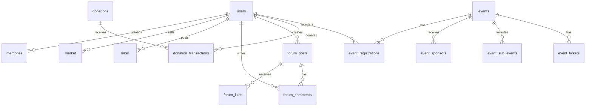

# Database Schema - IKA SMANSARA (PocketBase)

Skema database untuk aplikasi IKA SMANSARA menggunakan PocketBase.

---

## Collections Overview



---

## 1. Users (Extends PocketBase Auth)

Koleksi bawaan PocketBase `users` dengan field tambahan.

| Field | Type | Required | Notes |
|-------|------|----------|-------|
| `name` | text | ✅ | Nama lengkap |
| `email` | email | ✅ | (PocketBase default) |
| `phone` | text | ✅ | No. WhatsApp |
| `avatar` | file | ❌ | Foto profil |
| `angkatan` | number | ❌ | Tahun lulus (null = Public) |
| `role` | select | ✅ | `alumni`, `public`, `admin` |
| `job_status` | select | ❌ | `swasta`, `pns_bumn`, `wirausaha`, `mahasiswa`, `lainnya` |
| `company` | text | ❌ | Nama perusahaan/instansi |
| `domisili` | text | ❌ | Kota domisili |
| `is_verified` | bool | ✅ | Default: false |
| `verified_at` | date | ❌ | Tanggal verifikasi |

**API Rules:**
- Create: Anyone (register)
- List/View: Admin only (untuk directory, filter by verified)
- Update: Owner or Admin
- Delete: Admin only

---

## 2. Events

| Field | Type | Required | Notes |
|-------|------|----------|-------|
| `title` | text | ✅ | Judul event |
| `date` | date | ✅ | Tanggal event |
| `time` | text | ✅ | Format: HH:mm |
| `location` | text | ✅ | Lokasi event |
| `description` | editor | ❌ | Deskripsi lengkap |
| `banner` | file | ❌ | Gambar banner |
| `status` | select | ✅ | `draft`, `active`, `completed` |
| `enable_sponsorship` | bool | ✅ | Default: false |
| `enable_donation` | bool | ✅ | Default: false |
| `donation_target` | number | ❌ | Target donasi (jika enabled) |
| `donation_description` | text | ❌ | Deskripsi donasi |
| `created_by` | relation | ✅ | → users |

---

## 3. Event Tickets

| Field | Type | Required | Notes |
|-------|------|----------|-------|
| `event` | relation | ✅ | → events |
| `name` | text | ✅ | Nama paket tiket |
| `price` | number | ✅ | Harga tiket (Rp) |
| `quota` | number | ✅ | Kuota peserta |
| `sold` | number | ✅ | Terjual (default: 0) |
| `includes` | json | ❌ | Array of string (contoh: ["Kaos", "Snack"]) |
| `image` | file | ❌ | Preview kaos/tiket |

---

## 4. Event Ticket Options

Opsi tambahan tiket (misal: ukuran kaos).

| Field | Type | Required | Notes |
|-------|------|----------|-------|
| `ticket` | relation | ✅ | → event_tickets |
| `name` | text | ✅ | Nama opsi (contoh: "Ukuran Kaos") |
| `choices` | json | ✅ | Array of `{label, extra_price}` |

---

## 5. Event Sub-Events

Kegiatan pendukung (cek kesehatan, donor darah, dll).

| Field | Type | Required | Notes |
|-------|------|----------|-------|
| `event` | relation | ✅ | → events |
| `name` | text | ✅ | Nama kegiatan |
| `description` | text | ❌ | Deskripsi singkat |
| `quota` | number | ❌ | Kuota (null = unlimited) |
| `registered` | number | ✅ | Terdaftar (default: 0) |
| `location` | text | ❌ | Lokasi stand |

---

## 6. Event Sponsors

Paket sponsorship untuk event.

| Field | Type | Required | Notes |
|-------|------|----------|-------|
| `event` | relation | ✅ | → events |
| `tier_name` | text | ✅ | Nama tier (Platinum, Gold, dll) |
| `price` | number | ✅ | Harga paket (Rp) |
| `benefits` | json | ✅ | Array of string |
| `logo` | file | ❌ | Logo sponsor (jika sudah ada) |
| `company_name` | text | ❌ | Nama perusahaan sponsor |
| `is_filled` | bool | ✅ | Default: false |

---

## 7. Event Registrations

Pendaftaran peserta event.

| Field | Type | Required | Notes |
|-------|------|----------|-------|
| `event` | relation | ✅ | → events |
| `ticket` | relation | ✅ | → event_tickets |
| `user` | relation | ✅ | → users |
| `ticket_code` | text | ✅ | Kode QR unik |
| `selected_options` | json | ❌ | Opsi yang dipilih |
| `sub_events` | relation[] | ❌ | → event_sub_events |
| `total_price` | number | ✅ | Total harga |
| `payment_status` | select | ✅ | `pending`, `paid`, `expired`, `refunded` |
| `payment_method` | text | ❌ | Metode pembayaran |
| `payment_date` | date | ❌ | Tanggal bayar |
| `shirt_picked_up` | bool | ✅ | Default: false |
| `shirt_pickup_time` | date | ❌ | Waktu ambil kaos |
| `checked_in` | bool | ✅ | Default: false |
| `checkin_time` | date | ❌ | Waktu check-in |

---

## 8. Donations (Campaigns)

| Field | Type | Required | Notes |
|-------|------|----------|-------|
| `title` | text | ✅ | Judul campaign |
| `description` | editor | ✅ | Deskripsi lengkap |
| `target_amount` | number | ✅ | Target donasi (Rp) |
| `collected_amount` | number | ✅ | Terkumpul (default: 0) |
| `deadline` | date | ✅ | Batas waktu |
| `banner` | file | ❌ | Gambar banner |
| `organizer` | text | ✅ | Nama penyelenggara |
| `category` | select | ✅ | `infrastruktur`, `pendidikan`, `sosial`, `kesehatan`, `lainnya` |
| `priority` | select | ✅ | `normal`, `urgent` |
| `status` | select | ✅ | `draft`, `active`, `completed`, `closed` |
| `donor_count` | number | ✅ | Jumlah donatur (default: 0) |
| `created_by` | relation | ✅ | → users |

---

## 9. Donation Transactions

| Field | Type | Required | Notes |
|-------|------|----------|-------|
| `donation` | relation | ✅ | → donations |
| `user` | relation | ❌ | → users (null = anonim) |
| `donor_name` | text | ✅ | Nama donatur (bisa "Hamba Allah") |
| `amount` | number | ✅ | Jumlah donasi (Rp) |
| `message` | text | ❌ | Pesan/doa |
| `is_anonymous` | bool | ✅ | Default: false |
| `payment_status` | select | ✅ | `pending`, `success`, `failed` |
| `payment_method` | text | ❌ | Metode pembayaran |
| `transaction_id` | text | ✅ | ID transaksi unik |

---

## 10. News

| Field | Type | Required | Notes |
|-------|------|----------|-------|
| `title` | text | ✅ | Judul berita |
| `slug` | text | ✅ | URL-friendly ID |
| `category` | select | ✅ | `prestasi`, `kegiatan`, `pengumuman`, `alumni_sukses`, `lainnya` |
| `thumbnail` | file | ❌ | Gambar thumbnail |
| `summary` | text | ✅ | Ringkasan (preview) |
| `content` | editor | ✅ | Konten lengkap |
| `author` | relation | ✅ | → users |
| `publish_date` | date | ✅ | Tanggal publish |
| `status` | select | ✅ | `draft`, `published` |
| `view_count` | number | ✅ | Default: 0 |

---

## 11. Forum Posts

| Field | Type | Required | Notes |
|-------|------|----------|-------|
| `user` | relation | ✅ | → users |
| `content` | text | ✅ | Isi postingan |
| `image` | file | ❌ | Gambar lampiran |
| `category` | select | ✅ | `karir_loker`, `nostalgia`, `bisnis`, `umum` |
| `visibility` | select | ✅ | `public`, `alumni_only` |
| `like_count` | number | ✅ | Default: 0 |
| `comment_count` | number | ✅ | Default: 0 |
| `is_pinned` | bool | ✅ | Default: false |
| `status` | select | ✅ | `active`, `hidden`, `deleted` |

---

## 12. Forum Comments

| Field | Type | Required | Notes |
|-------|------|----------|-------|
| `post` | relation | ✅ | → forum_posts |
| `user` | relation | ✅ | → users |
| `content` | text | ✅ | Isi komentar |
| `parent` | relation | ❌ | → forum_comments (untuk reply) |

---

## 13. Forum Likes

| Field | Type | Required | Notes |
|-------|------|----------|-------|
| `post` | relation | ✅ | → forum_posts |
| `user` | relation | ✅ | → users |

**Unique Index:** `post` + `user`

---

## 14. Loker (Lowongan Kerja)

| Field | Type | Required | Notes |
|-------|------|----------|-------|
| `user` | relation | ✅ | → users (poster) |
| `position` | text | ✅ | Posisi/jabatan |
| `company` | text | ✅ | Nama perusahaan |
| `job_type` | select | ✅ | `fulltime`, `parttime`, `internship`, `freelance`, `remote` |
| `location` | text | ✅ | Lokasi kerja |
| `salary_range` | text | ❌ | Kisaran gaji |
| `description` | editor | ✅ | Deskripsi & syarat |
| `apply_link` | text | ✅ | Link/email lamaran |
| `status` | select | ✅ | `pending`, `approved`, `rejected`, `closed` |
| `expires_at` | date | ❌ | Tanggal kadaluarsa |

---

## 15. Market (Iklan Jual-Beli)

| Field | Type | Required | Notes |
|-------|------|----------|-------|
| `user` | relation | ✅ | → users (penjual) |
| `name` | text | ✅ | Nama produk |
| `category` | select | ✅ | `kuliner`, `fashion`, `jasa_professional`, `properti`, `lainnya` |
| `price` | number | ✅ | Harga (Rp) |
| `description` | editor | ❌ | Deskripsi produk |
| `images` | file[] | ❌ | Foto produk (multiple) |
| `location` | text | ✅ | Lokasi |
| `contact` | text | ❌ | Kontak (default: user.phone) |
| `status` | select | ✅ | `pending`, `approved`, `rejected`, `sold` |

---

## 16. Memories (Galeri Kenangan)

| Field | Type | Required | Notes |
|-------|------|----------|-------|
| `user` | relation | ✅ | → users (uploader) |
| `image` | file | ✅ | Foto kenangan |
| `year` | number | ✅ | Tahun foto |
| `description` | text | ❌ | Deskripsi/caption |
| `is_approved` | bool | ✅ | Default: false |
| `approved_by` | relation | ❌ | → users (admin) |

---

## Indexes & Performance

```sql
-- Event Registrations
CREATE INDEX idx_reg_user ON event_registrations(user);
CREATE INDEX idx_reg_event ON event_registrations(event);
CREATE INDEX idx_reg_status ON event_registrations(payment_status);

-- Donation Transactions
CREATE INDEX idx_donation_trx ON donation_transactions(donation);
CREATE INDEX idx_donation_status ON donation_transactions(payment_status);

-- Forum
CREATE INDEX idx_forum_category ON forum_posts(category);
CREATE INDEX idx_forum_user ON forum_posts(user);

-- Loker & Market (untuk moderation)
CREATE INDEX idx_loker_status ON loker(status);
CREATE INDEX idx_market_status ON market(status);
```

---

## PocketBase Hooks (Optional)

```javascript
// Auto-update donation collected_amount after successful transaction
onRecordAfterCreateRequest((e) => {
    const record = e.record;
    if (record.collection() === 'donation_transactions' && record.getString('payment_status') === 'success') {
        const donationId = record.getString('donation');
        const amount = record.getInt('amount');
        
        const donation = $app.dao().findRecordById('donations', donationId);
        donation.set('collected_amount', donation.getInt('collected_amount') + amount);
        donation.set('donor_count', donation.getInt('donor_count') + 1);
        $app.dao().saveRecord(donation);
    }
});

// Auto-update event ticket sold count
onRecordAfterCreateRequest((e) => {
    const record = e.record;
    if (record.collection() === 'event_registrations' && record.getString('payment_status') === 'paid') {
        const ticketId = record.getString('ticket');
        
        const ticket = $app.dao().findRecordById('event_tickets', ticketId);
        ticket.set('sold', ticket.getInt('sold') + 1);
        $app.dao().saveRecord(ticket);
    }
});
```
